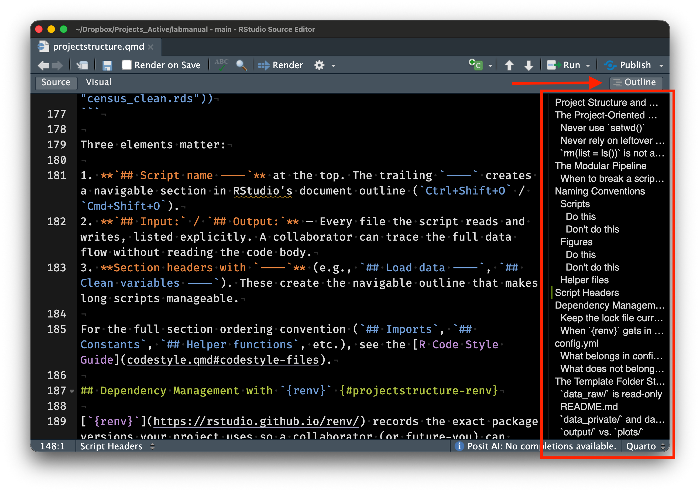

## Learning Objectives

By the end of this lecture, you should be able to:

1.  Articulate why scientific computing workflows matter for transparent, reproducible research.
2.  Distinguish between "workflow" (personal habits) and "product" (the code, data, and outputs that others see).
3.  Set up a project-oriented directory structure for a research analysis.
4.  Use `here::here()` to construct file paths instead of `setwd()`.
5.  Write a minimal reproducible example (reprex) to get help effectively.

## Course Overview and Motivation

### What this course is about

Our quantitative training is insufficient for modern, computer-based research. Graduate programs in epidemiology and population health teach rigorous statistical methods (regression, survival analysis, causal inference, time series). They rarely teach the practical computing skills that make those methods reproducible, transparent and efficient. You learn how to fit a Cox model, but not how to organize the project that contains it. The gap is real. You learn how to interpret a regression coefficient, but not how to write code that someone else — or future-you — can actually run.

This course fills that gap. It is not a statistics course. It is not a methods course. It is not even a coding course. It is about the *infrastructure* of quantitative research: how to organize projects, write clean code, manage data, collaborate with others, and communicate results. We use [`R`](https://cran.r-project.org) as our primary language, but the general principles apply to any language. We will rely mostly on examples from public health, but the skills learned in this class are applicable to any discipline that requires using a computer to do work.

### Why "good enough" practices?

Let's face it — we're all busy. "Best practices" set a bar most of us cannot clear and/or do not have the time to achieve. Wilson et al. [@wilson2014] outlined "Best Practices for Scientific Computing," targeting researchers who write substantial code. It's a great article. Unfortunately, for most of us, it is aspirational but impractical. A follow-up by many of the same authors, Wilson et al. [@wilson2017], scaled the recommendations to a more achievable bar — "Good Enough Practices in Scientific Computing."

Following Wilson et al., this course focuses mostly on the "good enough" practices and will (sometimes) expose you to the (aspirational) "best practices". Every week introduces practices that are achievable, immediately useful, and grounded in real research workflows.

### Course structure

::: callout-important
#### NOTE

This course is fictional! This is how I think I would have tried to structure the course but **I've never taught it.** You should adapt the materials to fit your own needs and if I ever get a chance to teach the course, this format is likely to change.
:::

The course runs for ten weeks with two 90-minute sessions per week. While this week is an exception, in general, each week will have one lecture session and one hands-on lab session. The labs are where you will practice the skills introduced in lecture on real data sets and real problems.

## The Research Computing Lifecycle

### A project is more than a manuscript

Every manuscript integrates hundreds of decisions. You start with a research question and a data source. You clean and reshape the raw data. You compute descriptive statistics. You fit models. You produce figures and tables. You write a manuscript. If you are lucky, someone tries to replicate your analysis.

Each stage involves dozens of choices. Which records did you exclude? How did you handle missing data? How did you link datasets? What variable definitions did you use? Which model specification did you settle on after trying alternatives? These decisions are the intellectual core of the analysis. In many research projects, they exist only in the analyst's memory, vague or poorly defined methods appendices, or random uncommented scripts.

**A research project is not just the manuscript.** It is the code, the data, the computational environment, and the documentation that allows someone (a collaborator, a reviewer, or your future self) to understand what was done and reproduce it. The ideal deliverable is a *research compendium* — a self-contained package that bundles narrative, data, and code into a single distributable unit [@marwick2018].

### The "works on my machine" problem

Scripts break when they move between computers. Sometimes scripts break on the same computer (e.g., updating a package). The script might depend on absolute file paths that exist on one machine only. It might load packages that are installed but never documented. It might assume a particular working directory or operating system.

These are not exotic bugs. They are the regular consequences of conflating the analyst's personal computing environment with the project's requirements.

, CC BY-NC 2.5)](assets/xkcd_2054_data_pipeline.png){fig-alt="A person presents a data pipeline diagram. Another person asks if it will break with unexpected input. The pipeline immediately collapses."}

The reproducibility problem boils down to a handful of rules: "avoid manual data manipulation steps," "record all intermediate results," and "for every result, keep track of how it was produced" [@sandve2013]. These rules sound obvious, but they are rarely applied in epidemiology research. We can, and should, do better.

Every stage generates decisions and outputs that need recording. The manuscript alone does not capture the full intellectual content of the analysis. @fig-lifecycle maps these stages and the artifacts each one produces.

```{mermaid}
%%| eval: true
%%| code-fold: true
%%| label: fig-lifecycle
%%| fig-cap: "The research computing lifecycle. Each stage of research (blue boxes) produces related artifacts (white boxes; e.g., code, data, documentation) culminating in a product for public consumption (green box; e.g., a manuscript). Each of these items together constitute the research compendium. The manuscript is just one output among many, and the entire group is necessary to reproduce the manuscript."
%%| fig-width: 7

flowchart TD
    A["Research Question"]:::stage --> B["Raw Data"]:::artifact
    B --> C["Data Cleaning"]:::stage
    C --> D["Analysis"]:::stage
    D --> E["Results"]:::stage
    E --> F["Manuscript"]:::manuscript
    F --> G["Replication"]:::replication

    B -.- B1["data_raw/"]:::folder
    C -.- C1["code/, data/"]:::folder
    D -.- D1["code/, output/"]:::folder
    E -.- E1["plots/, qmd/"]:::folder
    F -.- F1["manuscript/"]:::folder

    classDef stage fill:#dbeafe,stroke:#3b82f6,color:#1e3a5f
    classDef artifact fill:#fef3c7,stroke:#f59e0b,color:#78350f
    classDef manuscript fill:#dcfce7,stroke:#22c55e,color:#14532d
    classDef replication fill:#f3e8ff,stroke:#a855f7,color:#581c87
    classDef folder fill:#fff,stroke:#d1d5db,color:#6b7280
```

### What a well-organized project looks like

Projects are directories. The structure of your directory is therefore the structure of your project. A canonical directory structure for computational biology — raw data, processed data, code, output in clearly labeled directories — has been widely adopted across quantitative disciplines [@noble2009]. Project folders organized this way quickly orient readers — even if it's their first time viewing the project.

Here's an example adapted for epidemiology research:

``` text
mortality_analysis/
├── mortality_analysis.Rproj
├── README.md
├── config.yml
├── renv.lock
├── .gitignore
├── code/
│   ├── 01_ingest_raw_data.R
│   ├── 02_create_analytic_data.R
│   ├── 03_fit_models.R
│   ├── 04_fig1_trends.R
│   └── utils.R
├── data/
├── data_raw/
├── data_private/
├── output/
├── plots/
├── qmd/
├── lit/
└── manuscript/
```

Compare this with a project directory that looks like this:

``` text
stuff/
├── analysis_FINAL.R
├── analysis_FINAL_v2.R
├── analysis_FINAL_v2_ACTUALLY_FINAL.R
├── data.csv
├── data2.csv
├── data_new.csv
├── fig1.png
├── Untitled.R
└── notes.docx
```

The first directory tells you what the project contains, how the code should be executed (numbered scripts in `code/`), where raw versus processed data live, and where to look for results. The second tells you almost nothing. If you have ever inherited a project that looks like the second example, you already know why this matters.

, CC BY-NC 2.5)](assets/xkcd_1459_documents.png){fig-alt="A file listing showing documents named 'Untitled 138', 'Untitled 138 copy', 'Untitled 138 copy 2', and similar chaotic variations."}

::: {.callout-note collapse="true" title="Deep Dive: The Reproducibility Crisis in Computational Science"}
Reproducibility failures are common and consequential.

### High-profile failures

The Reinhart-Rogoff controversy is probably the most cited computational reproducibility failure in the social sciences. In 2010, economists Carmen Reinhart and Kenneth Rogoff published an influential paper arguing that countries with public debt exceeding 90% of GDP experienced sharply lower economic growth. The paper was widely cited by policymakers advocating for austerity measures in the aftermath of the 2008 financial crisis. In 2013, Herndon, Ash, and Pollin [@herndon2014] attempted to replicate the analysis and discovered that the original results were driven in part by a spreadsheet error — an incorrect cell range in an Excel formula had excluded several countries from a key average. The corrected analysis showed a much weaker relationship between debt and growth. This all could have been avoided (or lessened) if the project used publicly-available, version-controlled, scripted code to create its analysis — instead, a mundane human error led to a mistake that influenced economic policy.

The problem extends beyond economics. Ziemann, Eren, and El-Osta [@ziemann2016] found that roughly one in five papers in leading genomics journals contained gene name errors from Excel's automatic conversion of gene symbols (e.g., "SEPT2" converted to "2-Sep," "MARCH1" to "1-Mar"). These errors persisted in supplementary data files that other researchers relied on for downstream analyses. The problem was so pervasive that the HUGO Gene Nomenclature Committee renamed several human genes in 2020 to avoid it [@bruford2020].

### How common is the problem?

Most computational results in top-tier journals lack sufficient code and data for independent verification. A classic paper by Stodden, Seiler, and Ma [@stodden2018] highlights how extreme this problem is, even among papers published in high-profile journals. It also includes quotes from investigators for reasons they would not share their code or data. The results are startling and I encourage you to read it.

### Why this matters for epidemiology

This course focuses primarily on computational reproducibility — the ability to run the same code on the same data and obtain the same results [@barba2018]. But, a part of this is sharing your code openly and when possible sharing your data. Epidemiological analyses involve complex data processing pipelines — merging administrative datasets, applying inclusion/exclusion criteria, constructing exposure and outcome variables, running sensitivity analyses across multiple model specifications. Each step involves decisions that should be transparent and verifiable. Our work has direct influence on people's lives and we need to prove our work is trustworthy.
:::

## Project-Oriented Workflows

Every analysis should live in a self-contained project folder. And all references should be relative to the root of this project folder. Never use `setwd()` to navigate to it.

### The `setwd()` anti-pattern

> If the first line of your R script is
>
> setwd("C:\Users\jenny\path\that\only\I\have")
>
> I will come into your office and SET YOUR COMPUTER ON FIRE 🔥.
>
> -   [Jenny Bryan](https://tidyverse.org/blog/2017/12/workflow-vs-script/)

`setwd()` at the top of a script is a sign that the project's file management is fundamentally broken. Many R scripts start with a hard-coded path:

``` r
# BAD: This only works on one person's machine
setwd("/Users/matt/Dropbox/projects/mortality_analysis")
dat <- read.csv("data/raw_deaths.csv")
# Note: read.csv() is also not recommended — use readr::read_csv()
```

This code works on my laptop, but only my laptop. The absolute path `/Users/matt/Dropbox/projects/mortality_analysis` does not exist on anyone else's computer. If a collaborator (or I myself, working from a different machine) tries to run this script, it will fail immediately.

`setwd()` creates an invisible dependency between the script and the analyst's personal compute environment. The script *looks* self-contained, but it is not — it assumes a specific directory structure that is nowhere documented and cannot be inferred from the code alone.

The problem becomes concrete when two people collaborate:

``` r
# Alice's machine (Mac)
setwd("/Users/alice/Dropbox/mortality_project")

# Bob's machine (Windows)
setwd("C:/Users/bob/Documents/mortality_project")

# With here::here(), BOTH just write:
dat <- readr::read_csv(here::here("data_raw", "raw_deaths.csv"))
# No coordination needed — the .Rproj file anchors the root.
```

With `setwd()`, Alice and Bob need to coordinate their directory structures or maintain separate versions of every script. With `here::here()`, neither of them needs to think about it.

### The `rm(list = ls())` myth

> If the first line of your R script is
>
> `rm(list = ls())`
>
> I will come into your office and SET YOUR COMPUTER ON FIRE 🔥.
>
> -   Also [Jenny Bryan](https://tidyverse.org/blog/2017/12/workflow-vs-script/)

`rm(list = ls())` does not give you a clean slate. Placing it at the top of a script is well-meaning but ineffective:

``` r
# BAD: This does NOT give you a clean slate.
# It clears the global environment but does NOT:
#   - unload packages (library() calls persist)
#   - reset options() you changed
#   - close database connections
#   - reset the working directory
# The only reliable clean slate: restart R.
#   - Windows/Linux: Ctrl+Shift+F10
#   - macOS: Cmd+Shift+F10
rm(list = ls())
```

It clears objects from the global environment. That is all it does. Packages loaded with `library()` stay loaded. Options changed with `options()` stay changed. The working directory stays wherever it was set. If your script depends on a package that was loaded interactively but is not called with `library()` in the script, `rm(list = ls())` will not catch the problem. The script will "work" on your machine but fail when someone else runs it from a fresh session.

The reliable way to get a clean slate is to restart R entirely. In RStudio, that is Ctrl+Shift+F10 (Windows/Linux) or Cmd+Shift+F10 (macOS). A restart unloads all packages, clears the environment, resets options, and returns you to a fresh R session. If your script runs correctly after a restart, you can be much more confident that it will run on another machine.

::: callout-tip
## RStudio setting

Go to *Tools → Global Options → General* and uncheck "Restore .RData into workspace at startup." Also set "Save workspace to .RData on exit" to **Never**. This ensures that every R session starts clean, which is exactly what you want for reproducible work.
:::

### RStudio Projects and `.Rproj` files

`.Rproj` files set the working directory for you. Open one, and RStudio sets the working directory to that folder, launches a fresh R session, and loads any project-specific settings. No hard-coded paths needed.

The `.Rproj` file is a small text file containing project settings (indentation style, build tools, encoding). You rarely need to edit it directly. What matters is that it sits at the root of your project directory and acts as an anchor for both RStudio and the `here` package.

To create a new RStudio Project, go to *File → New Project* and choose either "New Directory" (for a fresh project) or "Existing Directory" (to add an `.Rproj` file to an existing folder). From that point on, you open the project by double-clicking the `.Rproj` file, and the working directory is automatically set to the project root.

### The `here` package

[`here`](https://here.r-lib.org/) solves the file path problem. It finds the project root (the directory containing the `.Rproj` file, a `.here` file, or a directory-level marker like `.git/`) and constructs paths relative to that root. Your code then works identically regardless of where the project folder lives on the file system.

``` r
# GOOD: Works on any machine with the same project structure
library(here)

# here::here() finds the project root automatically
here::here()
#> [1] "/Users/matt/projects/mortality_analysis"

# Build paths relative to the project root
dat <- readr::read_csv(here::here("data_raw", "raw_deaths.csv"))

# Saving output — same pattern
readr::write_csv(result_df, here::here("data", "cleaned_deaths.csv"))
```

The call `here::here("data_raw", "raw_deaths.csv")` constructs the full path by joining the project root with the relative components. On my Mac, this might resolve to `/Users/matt/projects/mortality_analysis/data_raw/raw_deaths.csv`. On your Windows machine, it might resolve to `C:/Users/bob/Documents/mortality_analysis/data_raw/raw_deaths.csv`. The script is identical in both cases. @fig-here-resolution illustrates this process.

```{mermaid}
%%| eval: true
%%| code-fold: true
%%| label: fig-here-resolution
%%| fig-cap: "How `here::here()` resolves the same relative path to different absolute paths on different machines. The `.Rproj` file anchors the project root; `here::here()` walks up the directory tree to find it, then joins the relative components to produce the full path."
flowchart TD
    code["here::here('data_raw', 'raw_deaths.csv')"]
    root["Finds project root via .Rproj / .here / .git"]

    code --> root
    root -->|"Alice's Mac"| alice
    root -->|"Bob's Windows PC"| bob

    alice["/Users/alice/.../data_raw/raw_deaths.csv"]

    bob["C:/Users/bob/.../data_raw/raw_deaths.csv"]

    style code fill:#1e293b,color:#a5b4fc,font-family:monospace
    style root fill:#eef2ff,stroke:#6366f1,color:#4338ca
    style alice fill:#f0fdf4,stroke:#86efac,color:#15803d
    style bob fill:#f0fdf4,stroke:#86efac,color:#15803d
```

Every file path in your scripts should use `here::here()`. Every project should have an `.Rproj` file. Follow those two rules and the `setwd()` problem disappears entirely.

[*What They Forgot to Teach You About R*](https://rstats.wtf) [@bryan_wtf] develops this pattern in detail and I highly recommend reading it.

::: {.callout-note collapse="true" title="Deep Dive: How here::here() Works Under the Hood"}
`here::here("data_raw", "file.csv")` has a simple interface, but the mechanism underneath matters when things go wrong. For our work, `here::here()` will "just work" but in the rare cases where it doesn't, it's helpful to understand what it is doing.

### The rprojroot algorithm

The `here` package is built on the [`rprojroot` package](https://rprojroot.r-lib.org/) [@muller_rprojroot] by Kirill Müller, which implements a general algorithm for finding the root directory of a project. When you call `here::here()`, it walks up the directory tree from the current working directory, testing each directory for the presence of specific *root criterion* files. The first directory that matches is declared the project root, and all subsequent `here::here()` calls resolve paths relative to that root.

The root is determined **once** (the first time `here::here()` is called in a session) and cached for the remainder. Calling `setwd()` after the first `here::here()` does not change the project root. This ensures that all path construction stays consistent within a session.

### Marker file precedence

The `here` package checks for root criterion files in the following order of precedence:

1.  **`.here`** — a sentinel file you can create manually with `here::set_here()`.
2.  **`.Rproj`** — an RStudio Project file (any file matching `*.Rproj`).
3.  **`DESCRIPTION`** — present in R packages and some compendia.
4.  **`remake.yml`**, **`.projectile`** — markers from other build/project systems.
5.  **`.git`**, **`.svn`** — version control directories.

The first match wins. If you have both a `.here` file and an `.Rproj` file in the same directory, the `.here` file takes precedence. If your project root contains a `.git` directory but no `.Rproj` file, `here` will still find it, which is useful for projects that are not RStudio-specific.

You can inspect the detected root at any time:

``` r
library(here)
here::here()
#> [1] "/Users/matt/projects/mortality_analysis"

# See which criterion was used:
here::dr_here()
#> here() starts at /Users/matt/projects/mortality_analysis
#> - This directory contains a file matching '[.]Rproj$'
#> - Initial working directory: /Users/matt/projects/mortality_analysis
```

### Edge cases

**Nested projects.** If you have a project inside another project (e.g., an R package inside a larger analysis repository), `here::here()` will find the *innermost* project root, the one closest to the current working directory. This is usually what you want, but it can be surprising if you open a sub-project without realizing it.

**Working outside RStudio.** If you run R from the command line (e.g., `Rscript code/01_clean.R`), the working directory is wherever you launched R from, not necessarily the project root. The `here` package will still walk up the directory tree to find a root criterion file, so it generally works, but only if you launch R from somewhere within the project directory tree.

**Symlinks.** If your project directory is accessed via a symbolic link, the resolved (physical) path may differ from the symlink path. The `here` package resolves symlinks, so `here::here()` returns the physical path. This can cause confusion when comparing paths visually.

### The `set_here()` escape hatch

If the automatic detection fails (for instance, if you are working in a directory with no `.Rproj`, `.git`, or other marker files), you can create a `.here` sentinel file manually:

``` r
here::set_here()
#> Created file .here in /Users/matt/weird_project
```

This creates an empty `.here` file in the current directory, which `here::here()` will find on subsequent calls. This is the recommended approach for non-standard project setups.
:::

### Workflow versus product

Workflow and product are different things (Bryan again [@bryan2017workflow]). Your *workflow* is personal and ephemeral — which text editor you use, how you organize your desktop, what keyboard shortcuts you prefer, where on your hard drive you keep your projects. Your *product* is what you share with the world — the R scripts, the data, the README, the manuscript.

*Your product should not depend on your workflow*. If your script requires knowledge of your personal file system layout to run, you have embedded your workflow into your product. For example, a script that reads from `/Users/matt/Dropbox/mortality_project/data/` works on my Mac but fails on every other machine. The Dropbox path is workflow; the relative path `data/raw_deaths.csv` is product. Your project folder should be self-contained and movable — different computer, different operating system, cloud server — without any changes to the code inside it.

### Canonical directory structure

A well-organized project separates files by function. The exact layout varies, but a reasonable default for an epidemiology analysis looks like this (based on [my lab's template](https://github.com/kianglab/new_project)):

-   `code/` — R scripts, numbered to indicate execution order.
-   `data_raw/` — Raw input data, exactly as downloaded or received. Never modified.
-   `data/` — Processed, shareable intermediate datasets (the output of your cleaning scripts).
-   `data_private/` — Restricted or individual-level data under a data use agreement. Gitignored.
-   `output/` — Tables, model objects, logs, and other non-figure outputs.
-   `plots/` — Final figures in publication-ready formats (PDF, PNG).
-   `qmd/` — Quarto or R Markdown documents for reports and tables.
-   `lit/` — PDFs of key references (gitignored if they are copyrighted).
-   `manuscript/` — Manuscript drafts (gitignored in most workflows).

### One script, one job

Each script should do exactly one thing. Read inputs, do the work, save outputs. Wilson et al. [@wilson2017] recommend writing "scripts for every stage of data processing," noting that "breaking a lengthy workflow into pieces makes it easier to understand, share, describe, and modify." The same idea appears as a driver-script pattern [@noble2009] and, most explicitly, as a rule to separate directories by function, separate files into inputs and outputs, and automate everything with a single master script [@gentzkow2014].

Scripts communicate through files on disk — not objects lingering in the global environment. If `02_clean_data.R` produces `data/clean_deaths.RDS`, then `03_fit_models.R` reads that file. It does not depend on a data frame left behind in memory from a previous script.

```{mermaid}
%%| eval: true
%%| code-fold: true
%%| label: fig-modular-pipeline
%%| fig-cap: "A modular analysis pipeline. Each script reads defined inputs and writes defined outputs. The branch from `data/clean_deaths.RDS` to two downstream scripts illustrates reuse: one cleaning step feeds both modeling and descriptive analysis."
flowchart TD
    s1["01_download_data.R"]:::script --> f1["data_raw/raw_deaths.csv"]:::datafile
    f1 --> s2["02_clean_data.R"]:::script
    s2 --> f2["data/clean_deaths.RDS"]:::datafile
    f2 -->|"reuse"| s3["03_fit_models.R"]:::script
    f2 -->|"reuse"| q1["qmd/table1.qmd"]:::script
    s3 --> f3["output/model_fits.RDS"]:::datafile
    f3 --> s5["05_fig_trends.R"]:::script
    s5 --> f5["plots/fig_trends.pdf"]:::datafile
    q1 --> q2["qmd/table1.html"]:::datafile
    f5 --> ms["manuscript/main_text.docx"]:::manuscript
    q2 --> ms

    classDef script fill:#e8f0fe,stroke:#2d4a7a,color:#1a3055
    classDef datafile fill:#fef3e0,stroke:#b07020,color:#6d4210
    classDef manuscript fill:#e8d5f5,stroke:#7b2d8e,color:#4a1a5e
```

The monolithic alternative is painful. A 500-line `analysis.R` that downloads data, cleans it, fits models, and produces figures has to be rerun from the top every time anything changes. The modular version lets you restart from any checkpoint. Wilson et al. [@wilson2017] note that "saving intermediate files makes it easy to rerun parts of a data analysis pipeline, which in turn makes it less onerous to revisit and improve specific data-processing tasks." Anyone who has waited 45 minutes for a model to refit because they changed an axis label knows the feeling.

Four benefits justify the overhead:

1.  **Code review.** A 60-line script that ingests data and saves a cleaned `.RDS` can be reviewed, verified, and closed. A 500-line script that does everything must be re-reviewed every time any part changes.

2.  **Reuse of intermediate data.** `data/clean_deaths.RDS` is produced once by `02_clean_data.R`. Both `03_fit_models.R` and `04_descriptive_table.R` read from it (@fig-modular-pipeline). If the modeling code changes, the cleaning step is untouched.

3.  **Skipping expensive steps.** If `03_fit_models.R` takes 45 minutes and the model specification hasn't changed, you skip it and work on `05_fig_trends.R` using the saved model fits. The intermediate `.RDS` file is a checkpoint.

4.  **Pipeline manager portability.** When each script has defined inputs and outputs, it is already a node in a dependency graph — exactly the structure that pipeline managers like `targets` expect [@landau2021]. Converting to a formal pipeline (Session 19) becomes mechanical rather than architectural.

Some common conventions help facilitate this process. For example, scripts should have useful headers. The `## Input:` and `## Output:` lines in the header (shown in the "What a real script looks like" example below) document each script's function with the rest of the pipeline.

Numbering your scripts communicates execution order at a glance.[^1] When someone opens the `code/` directory and sees `01_ingest_raw_data.R`, `02_create_analytic_data.R`, `03_fit_models.R`, and `04_fig1_trends.R`, they immediately understand the pipeline's flow without reading any code.

[^1]: One clarification on numbering: script numbers in `code/` are independent of output numbers. Figure 1 in a manuscript often comes from a script that runs late in the pipeline, not from `01_*.R`. The code pipeline has its own ordering logic; the manuscript has its own. Cross-referencing numbers across directories (e.g., `03_fit_models.R` → `output/03_model_results.RDS`) can work for simple projects but breaks down for anything with more than a few outputs. Sandve et al. [@sandve2013] make a related point in their Rule 5: record all intermediate results, but organize them by content, not by the accident of which script produced them first.

### Choosing descriptive slugs

The number prefix handles *order*. The rest of the filename — the **slug** — handles *content*. Jenny Bryan borrows the term from journalism, where a "slug" is the short label that identifies a story as it moves through the newsroom [@bryan2015files; @bryan_wtf]. In a research project, the slug is the descriptive portion of the filename that tells you what the script does without opening it.

A good slug follows a **verb-noun pattern**: what the script *does* to what *data*. Compare these two `code/` directories:

``` text
BAD (vague slugs):
  01_data.R
  02_analysis.R
  03_results.R
  04_figure.R

GOOD (descriptive slugs):
  01_download_mortality_data.R
  02_clean_county_covariates.R
  03_fit_apc_models.R
  04_fig_trends_by_state.R
```

The first set tells you nothing. `01_data.R` could download data, clean data, reshape data, or simulate data. The second set reads like a pipeline summary — download, clean, model, plot. A collaborator opening this directory for the first time knows exactly where to look for the modeling code (script 03) or the figure code (script 04) without reading a single line of R.

Three practical guidelines for slugs:

1.  **Use verbs for processing scripts** — `download`, `clean`, `merge`, `fit`, `validate`. The verb tells you the *action*.
2.  **Use nouns (or verb-noun compounds) for output scripts** — `fig_survival_curves`, `tab_descriptive_stats`. The noun tells you the *product*.
3.  **Be specific enough to distinguish, short enough to scan** — `clean_county_covariates` is better than both `clean` (too vague) and `clean_acs_county_level_socioeconomic_covariates_2010_2020` (too long).

Note that I am pragmatic about slugs. The point is that they help you identify what the file does **without opening the file**. For self-evident files, I often do not use a verb — for example, `11_figure1_demographics.R` would likely not have a verb (e.g., `11_plot_figure1_demographics.R`) because the verb is obvious.

### What a real script looks like

Well-organized scripts follow a consistent structure. An example from an epidemiology analysis:

``` r
## 01_ingest_raw_data.R ----
##
## Download raw NCHS mortality data from CDC WONDER and save
## as a compressed RDS file. Requires internet access.
## Input: CDC WONDER API
## Output: data_raw/raw_deaths_1999_2020.RDS

## Imports ----
library(tidyverse)
library(here)

## Constants ----
START_YEAR <- 1999
END_YEAR <- 2020

## Download ----
# ... (download code would go here)

## Save ----
saveRDS(raw_df, here::here("data_raw", "raw_deaths_1999_2020.RDS"),
        compress = "xz")
```

The header comment block is the most important part. It describes what the script does, what inputs it requires, and what outputs it produces. Section markers (`## Section Name ----`) create navigable sections in RStudio's document outline (accessible via Ctrl+Shift+O on Windows/Linux, or Cmd+Shift+O on macOS). Constants are defined in `UPPER_SNAKE_CASE` at the top of the script, making them easy to find and modify. All file paths use `here::here()`.



This seems like more work, but the overhead pays for itself. Return to the project after six months, onboard a new collaborator, debug a pipeline that spans 8 scripts — the structure is already legible. Wickham, Çetinkaya-Rundel, and Grolemund [@wickham2023r4ds] make the same point in [*R for Data Science*](https://r4ds.hadley.nz): good code organization is an investment in your future self.

::: {.callout-note collapse="true" title="Deep Dive: Research Compendia and renv"}
Code and data are necessary but not sufficient. A truly reproducible analysis also needs to record the *computational environment* in which it was run. Two tools go further than the project-oriented workflow described above — the research compendium concept (formalized by `rrtools`) and environment management with `renv`.

### The research compendium

A *research compendium* is a self-contained unit that packages the narrative (manuscript or report), the data, the code, and the computational environment into a single distributable artifact [@marwick2018]. As with all things computing, there is a spectrum of compendia:

1.  **Small compendium:** An organized directory with a README, data files, and scripts. This is essentially what we teach in the main body of this lecture.
2.  **Medium compendium:** The directory is structured as an R package, with a `DESCRIPTION` file listing dependencies, an `R/` directory for reusable functions, and a `vignettes/` directory for the manuscript. This leverages R's built-in dependency management.
3.  **Large compendium:** The R package is wrapped in a Docker container that captures the entire computational environment (operating system, system libraries, R version, package versions). This is the gold standard for reproducibility but requires more tooling.

Again, we are pragmatic about this. However, we always aim for *at least* a small compendium. Full Dockers are great and in some fields (e.g., when you need to compile code from source), they are absolutely necessary. This is rarely the case in epidemiology.

A medium compendium is a good goal. The [`rrtools` package](https://github.com/benmarwick/rrtools) [@marwick_rrtools] by Ben Marwick automates the creation of medium compendia. Running `rrtools::use_compendium("myanalysis")` generates a project skeleton structured as an R package, complete with a `DESCRIPTION` file, a `vignettes/` directory, and a pre-configured `.gitignore`.

### Environment management with renv

Package versions drift. An analysis that runs today with `dplyr` 1.1.4 might produce different results, or fail entirely, with `dplyr` 2.0.0 if the API changes. The [`renv` package](https://rstudio.github.io/renv/) [@ushey_renv] by Kevin Ushey addresses this by creating *project-local libraries* that are isolated from the user's system library.

The basic `renv` workflow has three steps:

``` r
# 1. Initialize renv in a project (creates renv/ directory and lockfile)
renv::init()

# 2. Work normally — install packages, write code, etc.
# When ready, snapshot the current state:
renv::snapshot()
#> This creates/updates renv.lock with exact package versions

# 3. A collaborator (or future you) restores the environment:
renv::restore()
#> Installs exactly the versions recorded in renv.lock
```

The `renv.lock` file is a JSON file that records every package, its version, and its source (CRAN, GitHub, Bioconductor, etc.). When committed to version control, it is a complete manifest of the project's package dependencies. Anyone who clones the repository can run `renv::restore()` to reconstruct the exact same package environment.

Key implementation details:

-   `renv` uses a **global package cache** on disk, so packages are downloaded once and linked into project libraries rather than duplicated. This saves disk space when many projects use the same packages.
-   The project-local library lives in `renv/library/`, which is gitignored by default (only the lockfile and `renv/activate.R` are committed).
-   `renv` supports multiple package sources: CRAN, Bioconductor, GitHub (via `remotes`), and local packages.

, CC BY-NC 2.5)](assets/xkcd_2347_dependency.png){fig-alt="A tower of blocks labeled 'all modern digital infrastructure' balanced precariously on a small block labeled 'a project some random person in Nebraska has been mass maintaining since 2003.'"}

### Docker: the next level

For maximum reproducibility, the "Rockerverse" provides a collection of Docker images and R packages for containerized R workflows [@nust2020]. A Docker container wraps not just the R packages but the entire operating system environment, including system libraries, the R version, and even compiled dependencies. The `rocker/r-ver` images provide versioned R installations, while `rocker/tidyverse` adds the tidyverse stack.

Containers are beyond the scope of this course. They are the logical endpoint of the reproducibility spectrum — if you can run a Docker container, you can reproduce the analysis. For most applied epidemiology work, `renv` strikes a practical balance between reproducibility and convenience.
:::

## Plain Text and Documentation

### Why plain text matters

Research projects run on plain text. The `.R` scripts, `.csv` data files, `.md` documentation, and `.qmd` Quarto documents that make up a well-organized project are all plain text. There are an infinite number of practical reasons to keep it that way.

A `.csv` file written in 1995 is still readable today, with any text editor on any operating system. Try saying that about a `.sav` file from SPSS 12 or an `.xlsx` that depends on a specific version of Excel's binary format. Plain text is durable. When you store data and code as plain text, you are betting your files will still be usable in 10 or 20 years. It is a very safe bet.

Plain text is tool-agnostic. A `.R` script written on macOS runs identically on Windows or Linux. A `.csv` file can be read by R, Python, Stata, SAS, Excel, and any general-purpose programming language. Binary formats lock you into a specific tool or platform.

Plain text works with version control. Git (covered in Session 03) tracks changes line by line. Modify a `.R` script and commit the change, and Git records exactly which lines changed — making it possible to review history, compare versions, and revert mistakes. Binary files like `.docx` or `.xlsx` are opaque to Git; it can tell that something changed, but not what.

Your primary workflow should be plain text. Healy [@healy2019] makes the case comprehensively. Binary formats are not always wrong — sometimes you need a Word document for a collaborator who insists on it — but they should be outputs, not inputs. Healy's course materials for [Modern Plain Text Computing](https://mptc.io/) [@healy_mptc] at Duke develop this argument further; we draw on them throughout the quarter.

### The README as a project's front door

Every project needs a `README.md` at its root. The README is the first thing someone sees when they encounter your project, whether they are opening the folder on a shared drive or visiting the repository on GitHub. A good README answers three questions: What does this project do? How do I run it? Where do I find the data?

Here is a minimal example:

``` markdown
# Mortality Trends Analysis

## Overview
Analysis of US county-level mortality trends, 1999-2020.

## Requirements
- R >= 4.3.0
- See `renv.lock` for package dependencies

## Reproducing the Analysis
Run scripts in `code/` in numbered order:
1. `01_ingest_raw_data.R` — downloads and caches raw NCHS data
2. `02_create_analytic_data.R` — cleans and reshapes
3. `03_fit_models.R` — fits age-period-cohort models
4. `04_fig1_trends.R` — generates Figure 1

## Data
Raw data are publicly available from CDC WONDER.
Private data (under DUA) are stored in `data_private/` (gitignored).
```

Twenty lines orient a reader completely. They now know the project's purpose, the software requirements, how to reproduce the analysis, and where the data come from. Update the README continuously as the project evolves [@wilson2017]. It is documentation, not decoration.

### A brief introduction to Quarto

Sometimes, it is useful for code and prose to belong in the same document. [Quarto](https://quarto.org), developed by Posit (the company behind RStudio), renders `.qmd` files to HTML, PDF, Word, or presentation slides. We use it in this course to generate tables, the first paragraph of your results section, and reproducible reports — anything where a number in the output should trace back to code. The manuscript itself may live in a separate Word or LaTeX file; Quarto handles the computational components that feed into it.

Quarto documents are plain text, they live happily in version control, and they produce professional-quality output. We introduce features progressively over the quarter. What you need to know for now is that they are plain-text and have a simple formatting style (markdown) that we will use throughout this course.

::: {.callout-note collapse="true" title="Deep Dive: Character Encoding and File Formats"}
"Plain text" glosses over a technical detail that matters in practice — the *encoding* that maps bytes on disk to characters on screen. Encoding issues corrupt epidemiological data regularly, especially when datasets contain names with diacritics (e.g., "José," "Müller"), characters from non-Latin scripts, or special symbols.

### ASCII and its limitations

ASCII ([American Standard Code for Information Interchange](https://en.wikipedia.org/wiki/ASCII), defined in the 1960s) uses 7 bits to represent 128 characters — the English alphabet (upper and lowercase), digits, punctuation, and a handful of control characters (newline, tab, etc.). It cannot represent accented characters, non-Latin scripts, or most mathematical symbols.

For decades, the computing world dealt with this limitation through a patchwork of *extended encodings* — [Latin-1](https://en.wikipedia.org/wiki/ISO/IEC_8859-1) (ISO 8859-1) for Western European languages, [Shift-JIS](https://en.wikipedia.org/wiki/Shift_JIS) for Japanese, [Big5](https://en.wikipedia.org/wiki/Big5) for Traditional Chinese, and so on. Each encoding used the same byte values to represent different characters, which meant that a file written in one encoding could display as gibberish when opened with another. This problem was known as "[mojibake](https://en.wikipedia.org/wiki/Mojibake)" (文字化け, literally "character transformation" in Japanese).

### UTF-8: the solution

[UTF-8](https://en.wikipedia.org/wiki/UTF-8) solves this. Part of the [Unicode standard](https://en.wikipedia.org/wiki/Unicode), it can represent every character in every modern writing system (over 149,000 characters as of Unicode 16.0). UTF-8 is backward-compatible with ASCII (the first 128 code points are identical) and variable-width (common characters use 1 byte, rarer ones use 2–4 bytes). It is now the dominant encoding on the web and in modern software.

There is no such thing as "plain text" without an encoding. Every text file is encoded in *something*, and assuming the wrong encoding produces garbage [@spolsky2003]. The practical implication — **always use UTF-8**, and always be explicit about it.

### The BOM problem

Excel on Windows prepends a [byte order mark](https://en.wikipedia.org/wiki/Byte_order_mark) (BOM, Unicode `U+FEFF`) to UTF-8 files to signal the encoding. Most Unix tools and many R functions do not expect the BOM and treat it as part of the file content. This produces mysterious failures — a column name that looks correct but does not match in joins or filters, because the first column name has an invisible BOM character prepended to it.

If you encounter a CSV file whose first column name is `id` instead of `id` (or equivalently, a column that fails to match even though it "looks right"), a BOM is the likely culprit.

### Line endings: LF vs CRLF

Line endings differ across operating systems ([see Wikipedia](https://en.wikipedia.org/wiki/Newline)). Unix-based systems (macOS, Linux) use a single line feed character (`\n`, LF). Windows uses a carriage return followed by a line feed (`\r\n`, CRLF). The difference is invisible in most editors but causes problems in version control (Git may report spurious changes on every line) and in shell scripts (a trailing `\r` causes confusing errors).

Git can be configured to handle line ending conversion automatically (`core.autocrlf`), and most modern editors normalize line endings. But when working with data files transferred between operating systems, it is worth knowing that the issue exists.

### readr vs base R for encoding

`readr::read_csv()` [@wickham_readr] handles encoding better than base R's `read.csv()`. Two differences matter:

-   `readr::read_csv()` assumes UTF-8 encoding by default and provides a `locale` argument for specifying alternatives. It also emits clear warnings when it encounters encoding problems.
-   `read.csv()` uses the system's native encoding by default, which varies by operating system and locale. On a US English Windows machine, this is typically Windows-1252 (a Latin-1 superset); on macOS and Linux, it is typically UTF-8. This inconsistency means that the same `read.csv()` call can produce different results on different machines.

For epidemiological work with international data (death certificates with non-English names, WHO data with country names in multiple languages, free-text survey responses), always use `readr::read_csv()` with explicit UTF-8 encoding:

``` r
# Explicit UTF-8 reading (readr default, but being explicit is good practice)
dat <- readr::read_csv(
  here::here("data_raw", "mortality_intl.csv"),
  locale = readr::locale(encoding = "UTF-8")
)
```
:::

## Getting Help: How to Make a Reprex

This lecture covered a lot of ground quickly. You will encounter errors and problems and you will need help. Minimal reproducible examples are the key to effectively and efficiently getting (and receiving) help with code.

### The problem with "it doesn't work"

Your code will break. It will produce an error message you do not understand, or it will run without errors but produce the wrong output. When this happens, you need help from someone else — a classmate, the instructor, a colleague, or an online community.

A *minimal reproducible example* (reprex) is the fastest path to effective help. A reprex is a small, self-contained piece of code that demonstrates your problem and that someone else can run on their own machine. The key word is *reproducible*: if the person helping you cannot reproduce the problem, they cannot diagnose it. @fig-reprex-workflow shows the basic process.

```{mermaid}
%%| eval: true
%%| code-fold: true
%%| label: fig-reprex-workflow
%%| fig-cap: "The reprex workflow. Write minimal code that demonstrates the problem, use the reprex package to format it, then share the formatted output."
%%| fig-width: 7
flowchart LR
    A["Write minimal code"] --> B["Copy to clipboard"]
    B --> C["reprex::reprex()"]
    C --> D["Formatted output"]
    D --> E["Share"]

    style A fill:#dbeafe,stroke:#3b82f6,color:#1e3a5f
    style B fill:#fef3c7,stroke:#f59e0b,color:#78350f
    style C fill:#f3e8ff,stroke:#a855f7,color:#581c87
    style D fill:#dcfce7,stroke:#22c55e,color:#14532d
    style E fill:#dcfce7,stroke:#22c55e,color:#14532d
```

### The `reprex` package

[`reprex`](https://reprex.tidyverse.org/) [@bryan_reprex] (by Bryan, Hester, Robinson, Wickham, and Dervieux) automates the formatting. Write the minimal code that demonstrates your problem, copy it to your clipboard, and run `reprex::reprex()`. The package executes your code in a clean R session, captures the output (including any error messages), and formats the result as Markdown you can paste directly into a GitHub issue, Stack Overflow question, or email.

Here is an example. Suppose you are trying to filter out rows with missing values, and your code does not seem to work:

``` r
# Step 1: Write the minimal code that demonstrates the problem.
# Copy this to your clipboard:

library(dplyr)

df <- tibble(
    name = c("Alice", "Bob", NA),
    score = c(90, 85, 78)
)

# I expect this to drop the NA row, but it doesn't work
df |>
    filter(name != NA)
```

Then run `reprex::reprex()` in the console to generate formatted output:

``` r
# Step 2: Run reprex to format and execute in a clean session
reprex::reprex()
```

The reprex output will show that `filter(name != NA)` returns zero rows, not the two rows you expected. This happens because comparisons with `NA` using `==` or `!=` always return `NA`, not `TRUE` or `FALSE`. The correct approach is to use `is.na()`:

``` r
# The correct way to filter NAs
df |>
    filter(!is.na(name))
```

The `NA` comparison trap catches most R beginners. The small, self-contained example makes the problem immediately obvious. Creating a reprex often solves the problem on its own. Distilling the issue to its essence forces you to think carefully about what is actually going wrong (Wickham, Çetinkaya-Rundel, and Grolemund, Ch. 8 [@wickham2023r4ds]).

::: callout-note
## Where to ask for help

When you have a well-crafted reprex, you can seek help in several places — the course discussion board (for course-related questions), [Posit Community](https://forum.posit.co/) (for R and RStudio questions), [Stack Overflow](https://stackoverflow.com/questions/tagged/r) (for general programming questions), and GitHub Issues (for package-specific bugs). The specific venue matters less than the quality of your question. A good reprex will get you useful answers almost anywhere.
:::

::: {.callout-note collapse="true" title="Deep Dive: Anatomy of a Good Reprex"}
Good reprexes take practice. This deep dive covers the technical details of the `reprex` package, tools for constructing example data, and principles for stripping a problem down to its essence.

### What makes a reprex "good"?

A good reprex has four properties (sometimes called a *minimal, complete, and verifiable example*):

1.  **Minimal:** It contains only the code necessary to demonstrate the problem. No extraneous library calls, no unrelated data transformations, no commented-out alternatives. Every line should be essential.
2.  **Complete:** It runs from top to bottom in a fresh R session without error (other than the error you are asking about). All packages are loaded with `library()`. All data are created inline, with no references to files on your computer.
3.  **Verifiable:** It produces the incorrect behavior you are reporting (or demonstrates the question you are asking). The reader should be able to run the code, see the problem, and understand what you expected to happen instead.
4.  **Self-contained:** It does not depend on any external state — no `setwd()`, no reading files, no database connections. Everything the reader needs is in the reprex itself.

### The reprex package in detail

[`reprex`](https://reprex.tidyverse.org/) [@bryan_reprex] automates running your code in a clean session and formatting the output. The basic workflow:

``` r
# Write your reprex code in an R script or copy it to the clipboard, then:
reprex::reprex()
# The output is placed on the clipboard, formatted for GitHub

# For Stack Overflow formatting:
reprex::reprex(venue = "so")

# For R console-style output (plain text):
reprex::reprex(venue = "r")

# To include session info (useful for debugging package issues):
reprex::reprex(si = TRUE)
```

The `venue` argument controls the output format — `"gh"` (GitHub-flavored Markdown, the default), `"so"` (Stack Overflow Markdown), `"r"` (commented R output), `"html"` (HTML), and others. The `si = TRUE` argument appends the output of `sessioninfo::session_info()` to the reprex, which documents the R version, operating system, and installed package versions.

Crucially, `reprex` runs your code in a **fresh, isolated R session**. If your reprex depends on a package that you loaded interactively but forgot to include in the `library()` calls, the reprex will fail. That is exactly the kind of problem you want to catch before sharing your code.

### Constructing example data with datapasta

Providing example data without referencing external files is the hardest part of a reprex. [`datapasta`](https://github.com/MilesMcBain/datapasta) [@mcbain_datapasta] (by Miles McBain) helps by letting you copy data from a spreadsheet, table, or data frame and paste it as R code.

For example, if you have a data frame in your R session, you can convert it to a `tribble()` call:

``` r
# Suppose you have this data frame:
df <- data.frame(
  county = c("Alameda", "San Francisco", "Santa Clara"),
  deaths = c(1234, 567, 890),
  pop = c(1671329, 873965, 1927852)
)

# datapasta can convert it to a tribble (for pasting into a reprex):
# In RStudio: copy df to clipboard, then Addins → "Paste as tribble"
# This produces:
tibble::tribble(
  ~county,          ~deaths, ~pop,
  "Alameda",        1234L,   1671329L,
  "San Francisco",  567L,    873965L,
  "Santa Clara",    890L,    1927852L
)
```

For very small examples, you can also construct data inline using `tibble::tibble()` or `data.frame()`, or use built-in datasets like `mtcars`, `iris`, or `dplyr::starwars`.

### Documenting your environment

R version and package versions matter when debugging package-specific issues. Two tools help:

``` r
# Base R (always available):
sessionInfo()

# More readable output (requires the sessioninfo package):
sessioninfo::session_info()
```

`sessioninfo::session_info()` is particularly useful because it lists not just loaded packages but also attached packages (loaded but not explicitly attached), and shows the source of each package (CRAN, GitHub, etc.). When filing a bug report on GitHub, always include session info.

### The art of minimality

Most reprexes include too much code. Reduction is itself a debugging technique. Start with your full failing code, then remove pieces one at a time, checking after each removal whether the problem persists. When you can no longer remove anything without making the problem disappear, you have a minimal reprex. Often the act of reduction reveals the bug.

A reprex should be under 20 lines of code. If it is longer, you probably have not stripped it down enough. The exception is when the bug requires a specific sequence of operations or data structure to trigger; in that case, provide the minimal such sequence.
:::

## Wrap-Up

### What's Next

**Session 02: Your Computer and the Shell** — Coming soon.

[Back to course homepage](../index.html)

### Reading for Session 02

1.  Healy K. *Modern Plain Text Computing*, Chapter 1-3. <https://mptc.io/>
2.  Bryan J (2015). "How to Name Files." Slides. URL: <https://speakerdeck.com/jennybc/how-to-name-files>

## References
