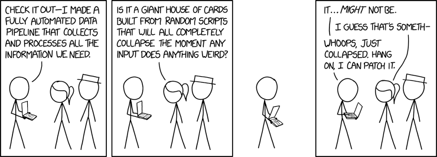
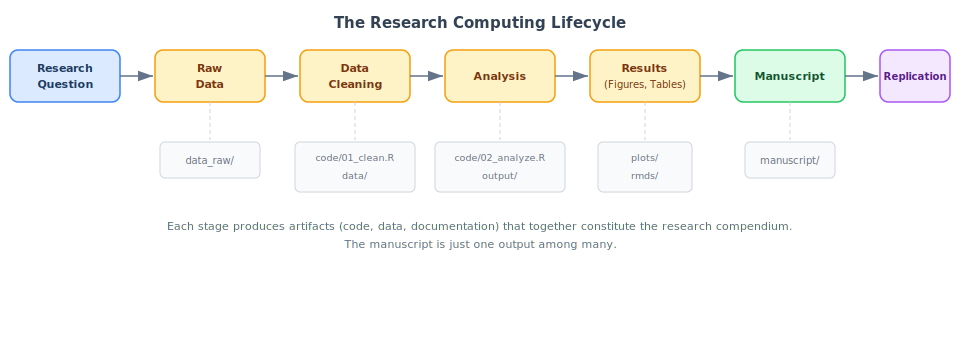
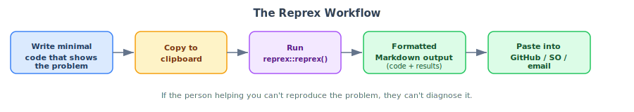

## Learning Objectives

By the end of this lecture, you should be able to:

1. Articulate why scientific computing workflows matter for transparent, reproducible research.
2. Distinguish between "workflow" (personal habits) and "product" (the code, data, and outputs that others see).
3. Set up a project-oriented directory structure for a research analysis.
4. Use `here::here()` to construct file paths instead of `setwd()`.
5. Write a minimal reproducible example (reprex) to get help effectively.

::: {.notes}
~2 min. Read through the objectives. These are the five things students should be able to do by the end of the session.
:::

# Course Overview and Motivation {background-color="#2d4a7a"}

## What this course is about

- **The gap:** epi training teaches methods (regression, survival analysis, causal inference) but not the *infrastructure* that makes them reproducible, transparent, and efficient
- You learn how to fit a Cox model, but not how to organize the project that contains it

. . .

- **This course fills that gap.** Not a statistics course, not a methods course, not a coding course — it is about the infrastructure of quantitative research
- **Primary language:** R + tidyverse, but principles apply to any language

::: {.notes}
~3 min + ~5 min student introductions. Introduce yourself. Ask students: name, department, what software they currently use for research. The gap is real — students learn how to interpret a regression coefficient, but not how to write code that someone else (or future-them) can actually run.
:::

## Why "good enough" practices?

:::: {.columns}
::: {.column width="50%"}
**Best Practices (2014)**

- Wilson et al., *PLOS Biology*
- Targets researchers who write substantial code
- Aspirational but impractical for most of us
:::

::: {.column width="50%"}
**Good Enough (2017)**

- Wilson et al., *PLOS Comp Bio*
- Scaled to an achievable bar for *all* researchers
- Small changes → big improvements
:::
::::

. . .

This course focuses on the "good enough" practices and will sometimes expose you to the aspirational "best practices."

::: aside
Wilson et al. (2017). [Good Enough Practices in Scientific Computing](https://doi.org/10.1371/journal.pcbi.1005510). *PLOS Comp Bio*, 13(6): e1005510.
:::

::: {.notes}
~3 min. The 2014 paper is great but aimed at researchers who already write software. The 2017 follow-up scaled the recommendations to a bar that any researcher using a computer can clear. Every week introduces practices that are achievable, immediately useful, and grounded in real research workflows.
:::

## Course structure

- **10 content weeks** + finals period for project presentations
- **2 sessions/week** (90 min each): one lecture, one lab
- **This week is an exception:** two lectures, no lab
  - Session 01 (today): Scientific computing workflow
  - Session 02 (next meeting): Shell & file system fundamentals
  - Labs start Week 2
- **Final project:** scaffolded assignments (Weeks 1–5), then independent project (Weeks 6–10)

::: {.notes}
~3 min. Walk through the syllabus quickly. Emphasize that each week builds on the previous one. The labs are where students practice skills on real datasets and real problems.
:::

# The Research Computing Lifecycle {background-color="#2d4a7a"}

## A project is more than a manuscript

Every manuscript integrates hundreds of decisions — which records to exclude, how to handle missing data, which model specification you settled on after trying alternatives.

. . .

These decisions are the intellectual core of the analysis. In many projects, they exist only in the analyst's memory or uncommented scripts.

. . .

::: {.callout-important}
**A research project includes the code, the data, the computational environment, and the documentation** — the manuscript is one output among several.
:::

::: aside
Marwick, Boettiger & Mullen (2018). [Packaging Data Analytical Work Reproducibly Using R (and Friends)](https://doi.org/10.1080/00031305.2017.1375986). *Am Stat*, 72(1): 80–88.
:::

::: {.notes}
~3 min. The ideal deliverable is a research compendium — a self-contained package that bundles narrative, data, and code. The manuscript is one output among many.
:::

## The "works on my machine" problem

:::: {.columns}
::: {.column width="65%"}
Scripts break when they move between computers. The script might depend on:

- **Absolute file paths** that exist on one machine only
- **Undocumented package dependencies** (installed but never documented)
- **Assumed working directory** or OS-specific behavior
- **Manual data manipulation** steps not captured in code
:::
::: {.column width="35%"}
{fig-align="center"}
:::
::::

. . .

These are not exotic bugs. They are the regular consequences of conflating your personal computing environment with the project's requirements.

::: aside
Sandve et al. (2013). [Ten Simple Rules for Reproducible Computational Research](https://doi.org/10.1371/journal.pcbi.1003285). *PLOS Comp Bio*, 9(10): e1003285. | xkcd 2054.
:::

::: {.notes}
~3 min. Every item on this list will seem obvious by Week 3. Sandve et al. distill reproducibility to a handful of rules: avoid manual data manipulation, record all intermediate results, and for every result keep track of how it was produced. These rules sound obvious but are rarely applied.
:::

## The research computing lifecycle

{fig-align="center"}

::: {.notes}
~2 min. Walk through the diagram. Every stage generates decisions and outputs that need recording. The manuscript alone does not capture the full intellectual content.
:::

## What a well-organized project looks like {.smaller}

:::: {.columns}
::: {.column width="50%"}
**Well-organized** ✅
```{.text}
mortality_analysis/
├── mortality_analysis.Rproj
├── README.md
├── config.yml
├── renv.lock
├── .gitignore
├── code/
│   ├── 01_ingest_raw_data.R
│   ├── 02_create_analytic_data.R
│   ├── 03_fit_models.R
│   ├── 04_fig1_trends.R
│   └── utils.R
├── data/
├── data_raw/
├── data_private/
├── output/
├── plots/
├── qmd/
├── lit/
└── manuscript/
```
:::
::: {.column width="50%"}
**Disorganized** ❌
```{.text}
stuff/
├── analysis_FINAL.R
├── analysis_FINAL_v2.R
├── analysis_FINAL_v2_ACTUALLY_FINAL.R
├── data.csv
├── data2.csv
├── data_new.csv
├── fig1.png
├── Untitled.R
└── notes.docx
```

. . .

The first directory tells you what the project contains, how the code should be executed, and where to look for results. The second tells you almost nothing.
:::
::::

::: aside
Noble (2009). [A Quick Guide to Organizing Computational Biology Projects](https://doi.org/10.1371/journal.pcbi.1000424). *PLOS Comp Bio*, 5(7): e1000424.
:::

::: {.notes}
~3 min. Ask students which directory looks familiar. The left side has a project file, a README, a lockfile, and directories separated by function. If you have ever inherited a project that looks like the right side, you know why this matters.
:::

# Project-Oriented Workflows {background-color="#2d4a7a"}

## The `setwd()` anti-pattern

> If the first line of your R script is `setwd("C:\Users\jenny\...")`, I will come into your office and SET YOUR COMPUTER ON FIRE 🔥.
>
> — [Jenny Bryan](https://tidyverse.org/blog/2017/12/workflow-vs-script/)

. . .

```{.r}
# BAD: This only works on one person's machine
setwd("/Users/matt/Dropbox/projects/mortality_analysis")
dat <- read.csv("data/raw_deaths.csv")
# Note: read.csv() is also not recommended — use readr::read_csv()
```

. . .

- The absolute path doesn't exist on anyone else's computer
- Creates an invisible dependency on *your* file system
- The script *looks* self-contained but is not

::: aside
Bryan (2017). [Project-oriented workflow](https://www.tidyverse.org/blog/2017/12/workflow-vs-script/). *Tidyverse Blog*.
:::

::: {.notes}
~4 min. This code works on my laptop, but only my laptop. The problem becomes concrete when two people collaborate — Alice's Mac and Bob's Windows PC need completely different paths. With `here::here()`, neither of them needs to think about it. We'll see the solution in a few slides.
:::

## The `rm(list = ls())` myth

```{.r}
# BAD: This does NOT give you a clean slate.
rm(list = ls())
```

. . .

`rm(list = ls())` clears objects but does **NOT**:

- Unload packages (`library()` calls persist)
- Reset `options()` you changed
- Close database connections
- Reset the working directory

. . .

**The only reliable clean slate** — restart R

- **Windows/Linux:** `Ctrl+Shift+F10`
- **macOS:** `Cmd+Shift+F10`

::: {.callout-tip}
## RStudio setting

Go to *Tools → Global Options → General*: uncheck "Restore .RData into workspace at startup" and set "Save workspace to .RData on exit" to **Never**. This ensures every R session starts clean.
:::

::: {.notes}
~3 min + ~2 min for students to change settings. Students often learn this pattern from tutorials. It gives a false sense of security. If the script depends on a package loaded interactively but not called with `library()`, `rm(list = ls())` won't catch it. Have students change their RStudio settings right now.
:::

## RStudio Projects and `.Rproj` files

`.Rproj` files set the working directory for you. Open one, and RStudio:

- Sets the working directory to that folder
- Launches a fresh R session
- Loads any project-specific settings

No hard-coded paths needed.

. . .

**To create one:** *File → New Project → New Directory* (or *Existing Directory*). The `.Rproj` file sits at the root of your project directory and acts as an anchor.

::: {.callout-tip}
Open RStudio, create a new project, and confirm `here::here()` returns the project root. Follow along.
:::

::: {.notes}
~5 min (includes live demo). Demonstrate: create a new project from scratch, show the .Rproj file in the Files pane, run `getwd()` and `here::here()`, show `here::here("data_raw", "file.csv")` building a path. Have students follow along on their own laptops.
:::

## The `here` package

```{.r}
library(here)

# Finds the project root automatically
here::here()
#> [1] "/Users/matt/projects/mortality_analysis"

# Build paths relative to the project root
dat <- readr::read_csv(here::here("data_raw", "raw_deaths.csv"))

# Same pattern for saving
readr::write_csv(result_df, here::here("data", "cleaned_deaths.csv"))
```

. . .

**How it works** — walks up the directory tree to find an anchor file (`.Rproj`, `.here`, `.git`, among others) and builds paths from there.

Every file path in your scripts should use `here::here()`. Every project should have an `.Rproj` file.

::: aside
Müller K. [`here`: A Simpler Way to Find Your Files](https://here.r-lib.org/). R package.
:::

::: {.notes}
~3 min. The call `here::here("data_raw", "raw_deaths.csv")` constructs the full path by joining the project root with the relative components. On Alice's Mac, this resolves to one absolute path; on Bob's Windows PC, another. The script is identical in both cases. The lecture notes have a deep dive on the underlying `rprojroot` algorithm for interested students.
:::

## Workflow versus product

Your **workflow** is personal and ephemeral — which text editor you use, how you organize your desktop, where on your hard drive you keep your projects.

Your **product** is what you share with the world — the R scripts, the data, the README, the manuscript.

. . .

**Your product should not depend on your workflow.** If your script requires knowledge of your personal file system layout to run, you have embedded your workflow into your product.

::: aside
Bryan (2017). [Project-oriented workflow](https://www.tidyverse.org/blog/2017/12/workflow-vs-script/). *Tidyverse Blog*.
:::

::: {.notes}
~3 min. This distinction is the conceptual anchor for the lecture. A Dropbox path is workflow; the relative path `data/raw_deaths.csv` is product. Your project folder should be self-contained and movable — different computer, different OS, cloud server — without any changes to the code.
:::

## Canonical directory structure

A well-organized project separates files by function:

| Directory | Purpose |
|-----------|---------|
| `code/` | R scripts, numbered for execution order |
| `data_raw/` | Raw input data — **never modified** |
| `data/` | Processed, shareable intermediate datasets |
| `data_private/` | Restricted data under DUA (gitignored) |
| `output/` | Tables, model objects, logs |
| `plots/` | Publication-ready figures (PDF, PNG) |
| `qmd/` | Quarto / R Markdown documents |
| `lit/` | Reference PDFs (gitignored) |
| `manuscript/` | Manuscript drafts |

::: {.notes}
~2 min. Based on my lab's template. The exact layout varies, but this is a reasonable default for an epidemiology analysis. The key principle: separate files by function, never by date or version.
:::

## One script, one job

Each script should do exactly one thing. Read inputs, do the work, save outputs.

- Scripts communicate through **files on disk** — not objects lingering in the global environment
- If `02_clean_data.R` produces `data/clean_deaths.RDS`, then `03_fit_models.R` reads that file

. . .

Four benefits:

1. **Code review** — a 60-line script can be reviewed, verified, and closed
2. **Reuse of intermediates** — one cleaning step feeds multiple downstream analyses
3. **Skipping expensive steps** — restart from any checkpoint
4. **Pipeline-ready** — each script is already a node in a dependency graph (`targets`, Session 19)

::: {.notes}
~3 min. The monolithic alternative: a 500-line `analysis.R` that downloads, cleans, models, and plots. Any change requires rerunning everything. The modular version lets you restart from any checkpoint. Anyone who has waited 45 minutes for a model to refit because they changed an axis label knows the feeling.
:::

## A modular pipeline

{fig-align="center"}

::: {.notes}
~2 min. Walk through the diagram. Numbering scripts communicates execution order at a glance. Note: script numbers in `code/` are independent of manuscript figure/table numbers — the code pipeline has its own ordering logic; the manuscript has its own.
:::

## Choosing descriptive slugs

The number prefix handles *order*. The **slug** handles *content*.

:::: {.columns}
::: {.column width="50%"}
**Vague slugs** (avoid)

```{.text}
01_data.R
02_analysis.R
03_results.R
04_figure.R
```
:::
::: {.column width="50%"}
**Descriptive slugs** (prefer)

```{.text}
01_download_mortality_data.R
02_clean_county_covariates.R
03_fit_apc_models.R
04_fig_trends_by_state.R
```
:::
::::

. . .

**Verb-noun pattern:** the verb says what the script *does*; the noun says to *what*. The good slugs read like a pipeline summary — download, clean, model, plot.

::: aside
Bryan J (2015). [How to Name Files](https://speakerdeck.com/jennybc/how-to-name-files). Slides.
:::

::: {.notes}
~3 min. A collaborator opening this directory knows exactly where to find the modeling code without reading any R. Session 02 covers the full three-principle file naming framework. I am pragmatic about slugs — for self-evident files, I often skip the verb (e.g., `11_figure1_demographics.R`).
:::

## What a real script looks like {.smaller}

```{.r}
## 01_ingest_raw_data.R ----
##
## Download raw NCHS mortality data from CDC WONDER and save
## as a compressed RDS file. Requires internet access.
## Input: CDC WONDER API
## Output: data_raw/raw_deaths_1999_2020.RDS

## Imports ----
library(tidyverse)
library(here)

## Constants ----
START_YEAR <- 1999
END_YEAR <- 2020

## Download ----
# ... (download code would go here)

## Save ----
saveRDS(raw_df, here::here("data_raw", "raw_deaths_1999_2020.RDS"),
        compress = "xz")
```

**Conventions:** header block with inputs/outputs, `## Section ----` markers for RStudio's outline (Ctrl+Shift+O / Cmd+Shift+O), `UPPER_SNAKE_CASE` constants, `here::here()` paths.

::: {.notes}
~3 min. Walk through each convention. The header block documents what the script does and what it produces. Section markers create navigable sections in RStudio's document outline. Constants at the top are easy to find and modify. This seems like more work, but the overhead pays for itself when you return to the project after six months or onboard a new collaborator.
:::

# Plain Text and Documentation {background-color="#2d4a7a"}

## Why plain text matters

:::: {.columns}
::: {.column width="33%"}
### Durable

A `.csv` from 1995 is still readable today.

Try that with `.sav` (SPSS 12) or `.xlsx` (Excel 2003).
:::
::: {.column width="33%"}
### Portable

`.R` scripts run on macOS, Windows, Linux.

`.csv` files work in R, Python, Stata, SAS, Excel.
:::
::: {.column width="34%"}
### Version-controllable

Git tracks line-by-line changes in text files.

Binary files (`.docx`, `.xlsx`) are opaque to Git.
:::
::::

. . .

Your primary workflow should be plain text. Binary formats are not always wrong — but they should be outputs, not inputs.

::: aside
Healy (2019). [The Plain Person's Guide to Plain Text Social Science](https://kieranhealy.org/publications/plain-person-text/).
:::

::: {.notes}
~3 min. Three reasons, escalating in importance. Durability is nice; portability is practical; version control changes how you work (Session 03). The Healy essay makes the comprehensive case. The lecture notes have a deep dive on character encoding for interested students.
:::

## The README: your project's front door {.smaller}

Every project needs a `README.md`. It answers three questions: what does this project do, how do I run it, where is the data?

```{.markdown}
# Mortality Trends Analysis

## Overview
Analysis of US county-level mortality trends, 1999-2020.

## Requirements
- R >= 4.3.0
- See `renv.lock` for package dependencies

## Reproducing the Analysis
Run scripts in `code/` in numbered order:
1. `01_ingest_raw_data.R` — downloads and caches raw NCHS data
2. `02_create_analytic_data.R` — cleans and reshapes
3. `03_fit_models.R` — fits age-period-cohort models
4. `04_fig1_trends.R` — generates Figure 1
```

Twenty lines orient a reader completely. Update continuously as the project evolves.

::: {.notes}
~2 min. A good README answers what, how, and where. GitHub renders it automatically on the repository homepage.
:::

## A brief introduction to Quarto

- **What:** open-source publishing system (by Posit) — Markdown + executable code → HTML, PDF, Word, slides
- **File extension:** `.qmd` — plain text, version-controllable, reproducible
- If you know R Markdown → Quarto is the next generation
- These slides, the lecture notes, and your assignments are all written in Quarto
- We introduce features progressively over the quarter

::: {.notes}
~2 min. Brief introduction — we return to Quarto throughout the course. The key points: plain text, version-control friendly, professional output.
:::

# Getting Help: How to Make a Reprex {background-color="#2d4a7a"}

## The problem with "it doesn't work"

Your code will break. When it does, a *minimal reproducible example* (reprex) is the fastest path to effective help.

The key word is *reproducible*. If the person helping you cannot reproduce the problem, they cannot diagnose it.

. . .

{fig-align="center"}

::: aside
Bryan, Hester, Robinson, Wickham & Dervieux. [`reprex`: Prepare Reproducible Example Code via the Clipboard](https://reprex.tidyverse.org/). R package.
:::

::: {.notes}
~2 min. The `reprex` package automates formatting: write minimal code, copy to clipboard, run `reprex::reprex()`, paste the formatted output into a GitHub issue or Stack Overflow question. It runs your code in a clean R session, catching hidden dependencies.
:::

## The `reprex` package

```{.r}
library(dplyr)

df <- tibble(
    name = c("Alice", "Bob", NA),
    score = c(90, 85, 78)
)

# I expect this to drop the NA row — but it returns 0 rows!
df |>
    filter(name != NA)
```

. . .

**Why?** Comparisons with `NA` using `==` or `!=` always return `NA`, not `TRUE`/`FALSE`.

. . .

**Fix:**

```{.r}
df |>
    filter(!is.na(name))
```

::: {.notes}
~3 min + ~3 min discussion. Walk through this slowly. The `NA` comparison trap catches most R beginners. Ask students: what do they think `NA != NA` evaluates to? Creating a reprex often solves the problem on its own — distilling the issue to its essence forces careful thinking about what is actually going wrong.
:::

## Where to ask for help

A good reprex gets useful answers almost anywhere:

- **Course discussion board** — course-related questions
- **[Posit Community](https://forum.posit.co/)** — R and RStudio
- **[Stack Overflow](https://stackoverflow.com/questions/tagged/r)** — general programming
- **GitHub Issues** — package-specific bugs

The **venue** matters less than the **quality** of your question.

::: {.notes}
~1 min. Quick list. Invest time in the reprex, not in choosing where to post.
:::

# Wrap-Up {background-color="#2d4a7a"}

## What's next

**Session 02: Your Computer and the Shell**

. . .

**Reading for Session 02:**

1. Healy K. *Modern Plain Text Computing*, Chs. 1–3. <https://mptc.io/>
2. Bryan J (2015). "How to Name Files." [Slides](https://speakerdeck.com/jennybc/how-to-name-files).

. . .

::: {.callout-note}
No lab this week. The hands-on project setup lab begins in **Session 04** after we cover Git and GitHub.
:::

::: {.notes}
~2 min. Remind students to do the reading before next session. The Healy chapters cover the shell basics we'll build on. Bryan's naming slides are short and memorable.
:::

# Appendix {visibility="uncounted"}

## How `here::here()` resolves paths {visibility="uncounted"}

{fig-align="center"}

Alice's Mac resolves to `/Users/alice/projects/mortality_analysis/data_raw/raw_deaths.csv`. Bob's Windows PC resolves to `C:/Users/bob/Documents/mortality_analysis/data_raw/raw_deaths.csv`. The code is identical — the `.Rproj` file handles the rest.

::: {.notes}
Appendix slide. Use if time permits or if students ask how here::here() resolves paths across machines. Note: this slide shows the OS-specific resolution that the main `here` slide does not cover. The lecture notes have a deep dive on the underlying rprojroot algorithm.
:::
